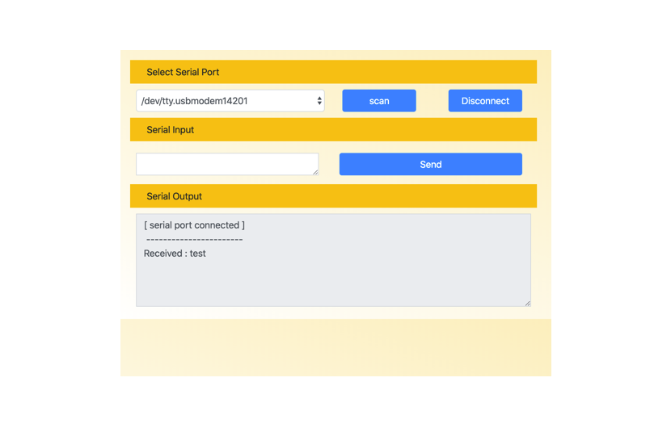

# Desktop Application for Serial Monitor (Based on Electron.js)



## Description

This application is used to communicate with serial-powered devices via serial communication. Built with Electron.js, it connects to devices using a fixed baud rate of 9600. The application provides both Serial Reader and Serial Writer functionality, allowing you to read and write serial data in real-time.

I use this application for my custom projects where I need to send specific commands to a robot gripper, but it can be adapted for any microcontroller-based or serial-powered device. This application is especially useful for debugging and monitoring serial communication between your computer and embedded systems.


## How to Run This Application

1. Navigate into the project directory:

    ```bash
    cd <this_repo>/src
    ```

2. Set proper permissions for the installation script:

    ```bash
    chmod 777 install.sh
    ```

3. Run the installation script:

    ```bash
    ./install.sh
    ```

    > If you encounter an error, try running:

    ```bash
    ./install_on_error.sh
    ```

4. Launch the application:

    ```bash
    ./run.sh
    ```

## Test Cases [ Serial Reader and Serial Writer ]

Both test cases are tested with **Arduino Uno** using a **baud rate of 9600** for serial communication.

